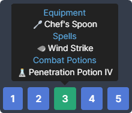

# Auto Gear Swap+

A Melvor Idle Mod on [Mod.io](https://mod.io/g/melvoridle/m/agsplus)

This mod will change your active gear set based on the [Combat Triangle](https://wiki.melvoridle.com/w/Combat_Triangle) and uses combat potions assigned to a set automatically. Includes a few options to toggle features.

## Features

### Automatically swap gear sets to counter enemy combat style

- Switches to best available set starting from set 1
- If no counter set available, switches to set that matches enemy combat style
- Stays in current set if already matching or if none available

### Assign potions to gear sets from potion select menu

### Potion button in combat player menu

### Equipment set tooltips show assigned potions

### Options

